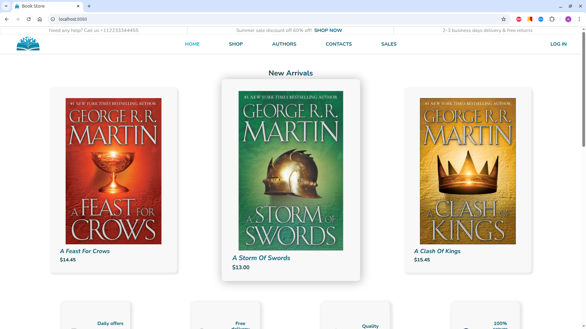
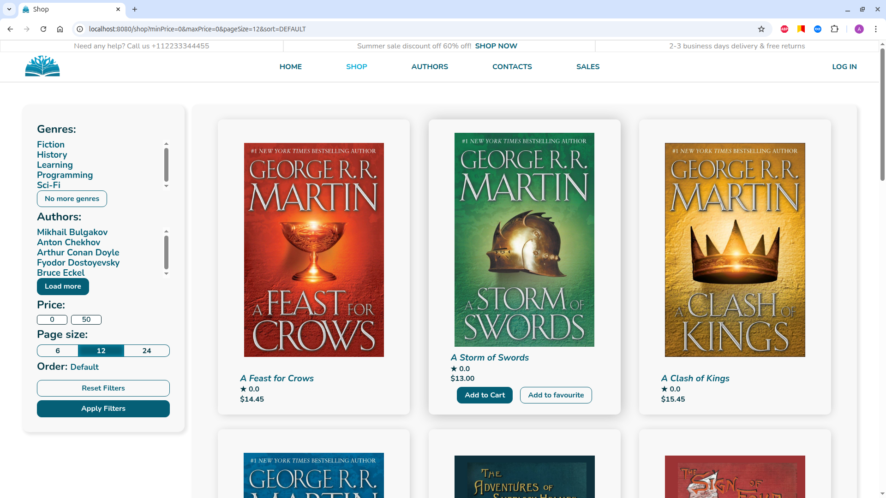
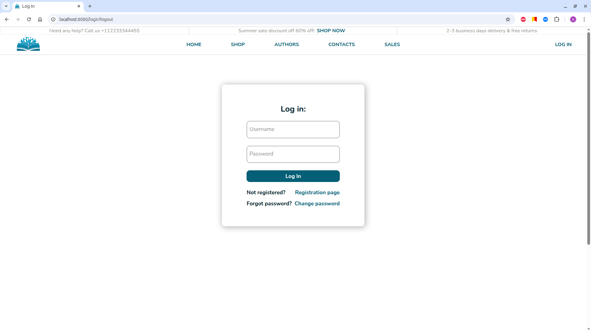
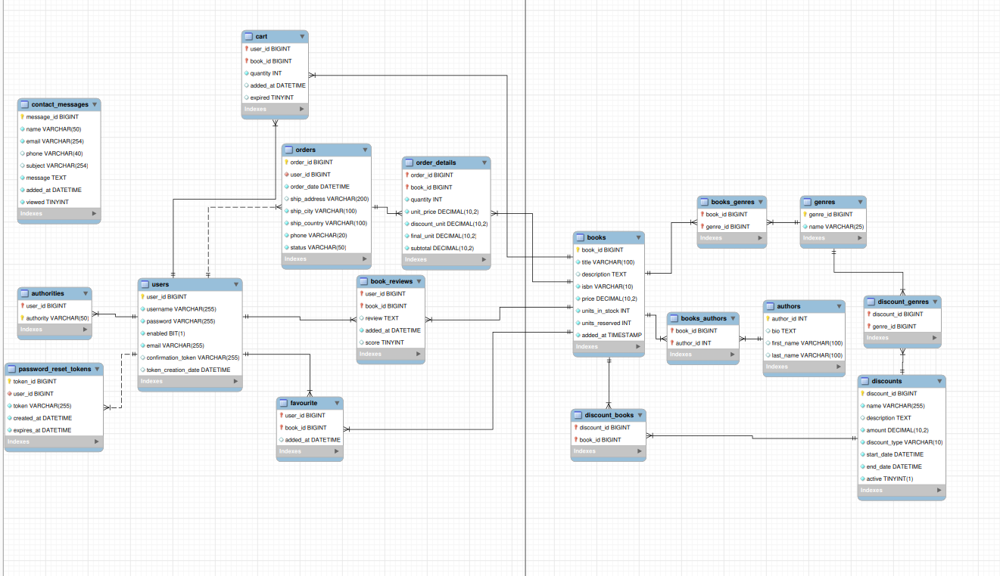

# 📚 Book Shop

**Book Shop** — an online bookstore built with Java, Spring, and Thymeleaf.  
Users can browse the catalog, add items to the cart, place orders, register on the website, and use the discount system.

---

## 🚀 Features

- Browse the book catalog with filtering and sorting  
- User registration and authentication  
- Add and remove items from the shopping cart  
- Place and manage orders  
- Discount and promotion system  
- Admin panel for managing products and orders  

---

## 🛠 Technologies


---

## 📸 Screenshots

Home page:  


Catalog page:  


Login page:


Database structure:


---

## 🔧 How to run

1. Clone the repository:
   ```bash
   git clone https://github.com/AlexT364/book-shop.git
   ```

2. Build the project:
   ```
   ./mvnw clean package
    ```

3. Copy `.env.example` to `.env` in root directory and adjust values if needed. `.env.example` contents:
    ```
    # ==============================
    # Database
    # ==============================
    SPRING_DATASOURCE_URL=jdbc:mysql://mysql:3306/book_shop
    SPRING_DATASOURCE_USERNAME=root
    SPRING_DATASOURCE_PASSWORD=root
    SPRING_DATASOURCE_DRIVER=com.mysql.cj.jdbc.Driver
    
    MYSQL_ROOT_PASSWORD=root
    MYSQL_DATABASE=book_shop
    
    # ==============================
    # Redis
    # ==============================
    SPRING_REDIS_HOST=redis
    SPRING_REDIS_PORT=6379
    
    # ==============================
    # RabbitMQ
    # ==============================
    SPRING_RABBITMQ_HOST=rabbitmq
    
    # ==============================
    # Mail (default: Mailhog)
    # ==============================
    SPRING_MAIL_HOST=mailhog
    SPRING_MAIL_PORT=1025
    SPRING_MAIL_USERNAME=no-reply@test.com
    SPRING_MAIL_PASSWORD=
    SPRING_MAIL_PROPERTIES_MAIL_SMTP_AUTH=false
    SPRING_MAIL_PROPERTIES_MAIL_SMTP_SSL_ENABLED=false
   
    ```

4. Start the application with Docker:
    ```
    docker-compose up
    ```
5. Open the application in your browser:
    ```
    http://localhost:8080
    ```
>[!NOTE]
>💡If you don’t provide your own SMTP host, port, and credentials, all outgoing emails will be delivered to Mailhog (default test mail server).
You can view them in your browser at:
>```
>http://localhost:8025
>```
